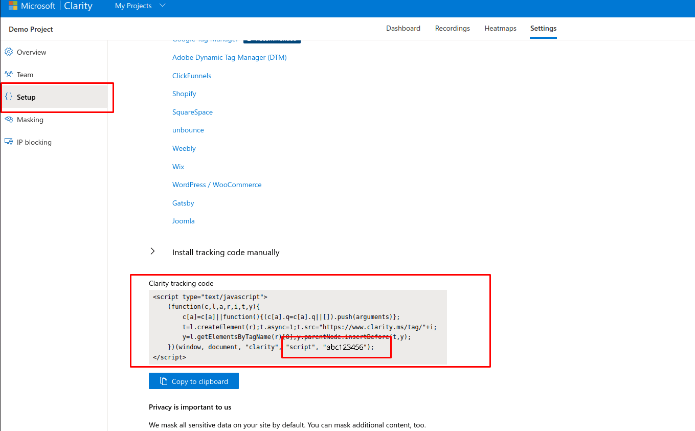
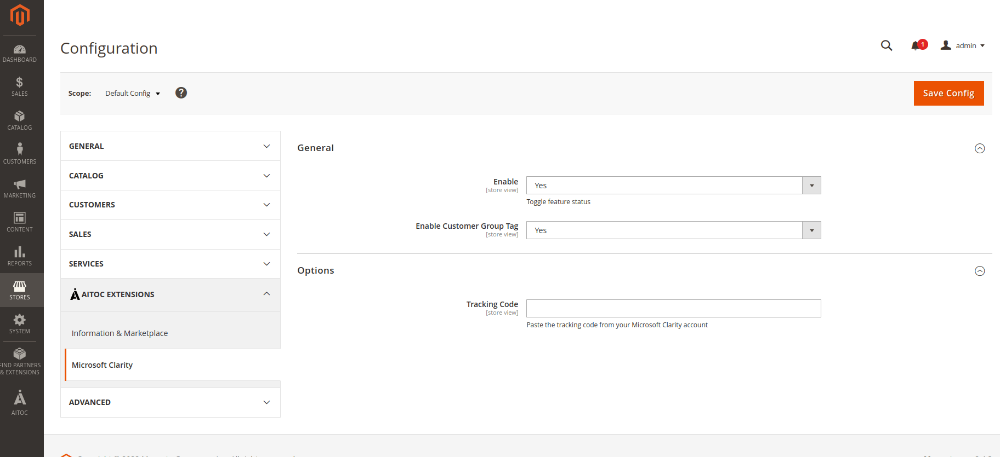
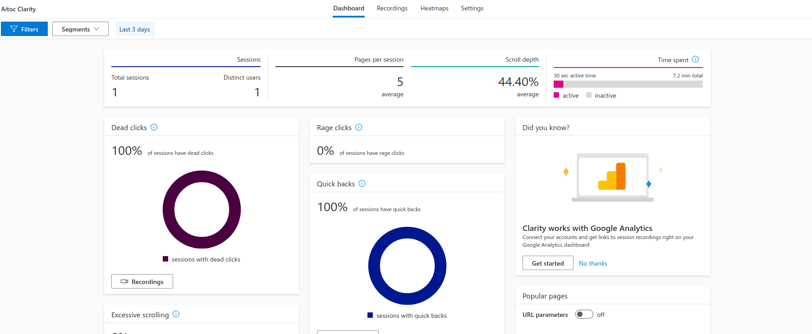

# [Microsoft Clarity for Magento](https://www.magexperts.com/microsoft-clarity.html)

## Description

[**Microsoft Clarity**](https://clarity.microsoft.com/) is an analytics tool that provides website usage statistics, session recording, and heatmaps. It is a free user behavior analytics tool that helps you understand how users interact with your website through session replays and heatmaps. It records the information about your website's visitors, tracks how users behave, and provide you with analytical data.

## Use of Microsoft Clarity module tool on the website

Because of our module, no code changes are required, or no need to manually add any script. By only adding tracking code from the Microsoft Clarity account, the Microsoft Clarity tool will get enabled on the website.

## Key Features

- The easiest way to enable the Microsoft Clarity tool
- No code changes are required to configure and start using Microsoft Clarity integration
- Session Recordings to see precisely how your site is being used
- Show Heatmaps and Clickmaps, which tell what users want and how you can play around with the design to get more attention from the user on specific things
- Multiple filter options to dig through user behavior and find accurate details

## Useful Information

- [**About Us**](https://www.magexperts.com/about-us.html) 
- [**Privacy Policy**](https://www.magexperts.com/privacy-policy.html)  
- [**Partnership Program**](https://www.magexperts.com/partnership-program)  
- [**Affiliate Program**](https://www.magexperts.com/affiliate-program)  
- [**Magexperts Customer Rewards**](https://www.magexperts.com/reward-points)  
- [**Microsoft Clarity User Guide**](https://www.magexperts.com/docs/microsoft-clarity/)  
- [**Get Support**](https://www.magexperts.com/get-support.html)  

## Installation Guide

### Installing module using zip file
 
- Unzip and paste the extension file into your root Magento folder.
- Connect to your server by SSH.
- Go to your Magento root folder.
- To install the extension, perform this command:
 
```
php bin/magento setup:upgrade
php bin/magento setup:di:compile
php bin/magento setup:static-content:deploy
```

### Composer installation

To install the module, you will need to run the following commands:

```
composer require magexperts/module-microsoft-clarity
php bin/magento setup:upgrade
php bin/magento setup:di:compile
php bin/magento setup:static-content:deploy -f
```

- To switch the extension on/off, perform these commands:
 
```
php bin/magento module:enable Magexperts_MicrosoftClarity
php bin/magento module:disable Magexperts_MicrosoftClarity
```

## Microsoft Clarity Tracking Code

Once you have created a new project in [**Microsoft Clarity**](https://clarity.microsoft.com/), from your Project Dashboard, select the **Setup** tab. In the Setup tab, you will find the **Clarity tracking code**, and below that the script will be available.
 
We only need the tracking code to configure and enable Microsoft Clarity on your Magento website from the script.
[](docs/trackingcode.png)

## Configuration

Path: **Stores → Configuration → AITOC EXTENSION → Microsoft Clarity** Or **Admin → AITOC → Microsoft Clarity → Configuration**

[](docs/config.png)
 
**Enabled:** _Yes/No_ - Sets whether the module is enabled or disabled. 
**Tracking Code:** _Text_ - Please enter your Microsoft Clarity tracking code here.
**Enable Customer Group Tag** - If this is enabled, custom tags and filters will be created based on the Customer Groups available in Magento in Microsoft Clarity. So for each session and page that are tracked in Clarity, they will have a Customer Group tag, so it will be easier to filter and find session/recording for each page based on customer group.

## How the module works
 
Once you have added the **Tracking Code**, the Microsoft Clarity Script will start to appear on the front end of each page. You can view this in Page Source or your browser's developer tools.
 
[](docs/console.png)
 
Also, in your [Microsoft Clarity](https://clarity.microsoft.com/) Account, under the project you have created, you will start to see analytics details based on visitors' activity on your site. You can see this in:
 
Log in to Your Microsoft Clarity Account, → Select your Project → Dashboard & Recording
 
[](docs/dashboard.png)

## More FREE Magento 2 Extensions by Magexperts on GitHub

- [**Google Customer Review**](https://github.com/magexperts/magento-2-google-customer-reviews) 
- [**SMTP**](https://github.com/magexperts/magento-2-smtp)  

## Other Magento 2 Extensions by Magexperts

- [**Save My Cart**](https://www.magexperts.com/save-my-cart.html) 
- [**No Password Login**](https://www.magexperts.com/no-password-login.html)  
- [**Invoice Payment**](https://www.magexperts.com/invoice-payment.html)  
- [**Order Export and Import**](https://www.magexperts.com/magento-2-orders-export-and-import.html)  
- [**Custom Product Designer**](https://www.magexperts.com/magento-2-custom-product-designer.html)  
- [**Advanced Permission**](https://www.magexperts.com/magento-2-advanced-permissions.html)

See more [**Magento 2 extensions**](https://www.magexperts.com/magento-2-extensions.html)

THANKS FOR CHOOSING AITOC 
